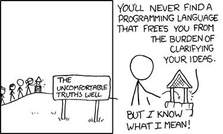

### Welcome! Get ready for PyNoon:

* Connect to the WiFi
* Check you can access:
  * [pynoon.github.io](https://pynoon.github.io/)
  * [colab.google](https://colab.google/)
  * [futurecoder.io](https://futurecoder.io/) (feel free to get started)
* If you need help, ask a neighbour or a helper wearing a lanyard
* **Once everyone's ready, we'll kick off the course intro**

### Thanks

* To the host for the great venue!
* To our sponsors

### Administrivia

* Fire escapes
* Toilets
* Cleaning up after ourselves
* WiFi

### Lunch Talk: AI-Assisted Python Programming

* ChatGPT, GitHub Copilot, etc. are quite good at generating Python code
* Will programming become obsolete?
* Do's/Dont's of programming with AI

### Will programming become obsolete?

* Probably not
* If anything, programming is more important to "glue" AI to
  data/systems
* AI-generated code often needs reviewing and fixing - **you still
  need to understand the code you're responsible for**
* The essence of programming is about *precisely* instructing a
  computer - you still need to carefully **consider** and
  **communicate** those instructions

<a href="https://xkcd.com/568/">xkcd.com/568</a>

### Do's/Dont's of programming with AI

* **DON'T** feed confidential data into public AI tools
* **DON'T** use generated code you don't understand
* **DON'T** use it to replace reading documentation
* **DO** ask it to explain code (as *one* perspective)
* **DO** use it generate snippets, start projects, and refactor (all
  with review)
* **DO** be specific in your instructions/requirements
* **DO** ask it to try fix code when the result is wrong

### Tutorial Objectives

1. Using AI models from Python
2. Loading data from a text file to construct a DataFrame

### Independent Work/Homework

1. **Exercise Notebook:**
   * AI Exercises
   * See the Exercise Notebook for PyNoon Plus Lesson 1 at
     [pynoon.github.io/lessons](https://pynoon.github.io/lessons)
2. **Work through the following [futurecoder.io](https://futurecoder.io) section**:
   * Boolean operators
3. Identify a **Personal Python Project** to work on
   * Start designing your solution
