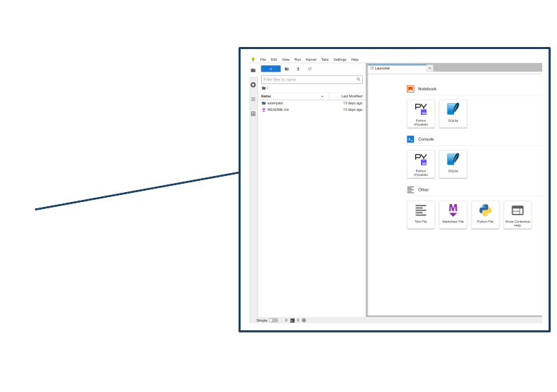

### Welcome! Get ready for PyNoon:

* Connect to the WiFi (see whiteboard)
* Check you can access:
  * [pynoon.slack.com](https://pynoon.slack.com)
  * [pynoon.github.io/jupyterlite](https://pynoon.github.io/jupyterlite)
  * [futurecoder.io](https://futurecoder.io/) (feel free to get started)
* If you need help, ask a neighbour or a helper wearing a lanyard
* **Once everyone's ready, we'll kick off the course intro**

### Tutorial Objectives

1. Three ways to use Python:
   * Python console
   * Python scripts
   * Python notebooks
2. Basic maths

### Independent Work/Homework

1. **Work through [futurecoder.io](https://futurecoder.io) sections**:
   1. The Shell
   2. String Basics
   3. Variables
2. **Exercise:** Write a notebook for a calculation:
   * E.g. Do a back-of-the-envelope calculation:
     * Sales/profit for a business
     * Floor area of your home or office
     * Number of weetbix NZ eats in a year
   * See the example in [pynoon.slack.com](https://pynoon.slack.com)
   * Name your notebook and variables well, and comment each part of
     the calculation
   * If you finish in class, explain your calculation to a
     neighbour

