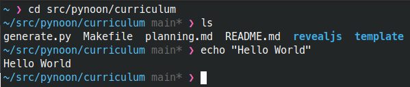
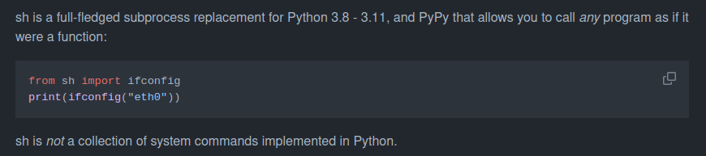
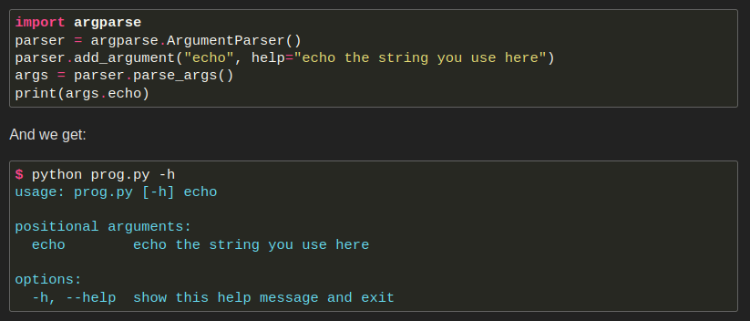
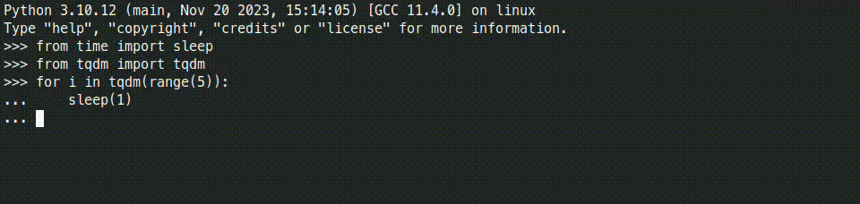
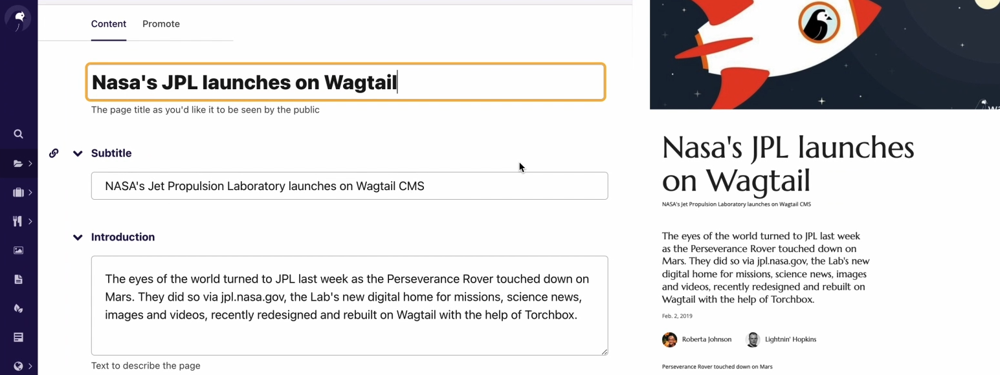
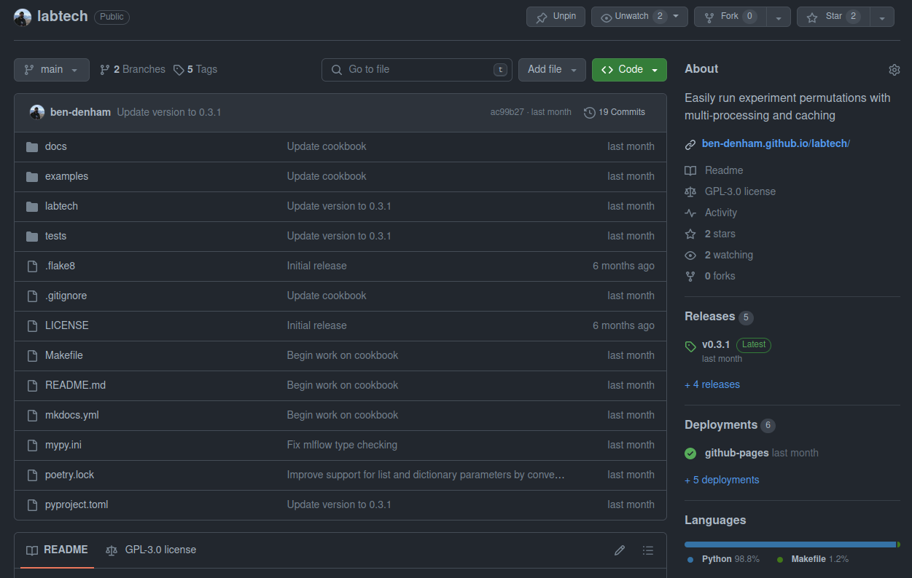

### Warm-Up Exercise

* Please fill out the survey
* Think of questions or topics you'd like to bring up during our
  wrap-up discussion
* Continue work on your Personal Python Project

### Thanks

* To the host for the great venue!
* Our supporting employers
* New Zealand Python User Group (NZPUG) for support

### Administrivia

* Fire escapes
* Toilets
* Cleaning up after ourselves
* WiFi


### PyNoon Finale: What Next?

* 10,000 foot view of topics not covered so far
* Recommendations for continuing learning
* Wrap-up discussion - start thinking of questions

### Object Oriented Programming (OOP)

<div style="font-size: 0.7em;">

* Define data types (**classes**) that are used to create **objects**
  that store their own variables (**attributes**) and functions
  (**methods**)
* [Dataclasses](https://docs.python.org/3/library/dataclasses.html)
  are particularly great for storing a bunch of related variables:

```python
from dataclasses import dataclass

@dataclass
class InventoryItem:
    """Class for keeping track of an item in inventory."""
    name: str
    unit_price: float
    quantity_on_hand: int = 0

    def total_cost(self) -> float:
        return self.unit_price * self.quantity_on_hand

my_item = InventoryItem(name='Notebook', unit_price=9.99, quantity_on_hand=5)
print(f'We have {my_item.total_cost()} worth of {my_item.name}')
```

</div>

### Python Scripting

### The command line

* Every operating system has a command-line/command-prompt/terminal
* It lets you run programs with text commands
  * Similar to the Python shell



### Running other programs

* Run commands from Python with:
  * [`subprocess`](https://docs.python.org/3/library/subprocess.html)
  * [`sh`](https://sh.readthedocs.io/en/latest/) (pip-installable)



### Command line interfaces (CLIs)

[`argparse`](https://docs.python.org/3/howto/argparse.html) lets you
specify arguments for a command-line interface:



### Also see:

<div style="font-size: 0.75em;">

* Find and work on files and folders with
  [`pathlib`](https://docs.python.org/3/library/pathlib.html)
* [Regular expressions (regexes)](https://docs.python.org/3/library/re.html) for
  matching/extracting strings
* [TOML](https://docs.python.org/3/library/tomllib.html) for configuration files
* Simple flat-file SQL database: [sqlite3](https://docs.python.org/3/library/sqlite3.html)
* Run multiple tasks at the same time
  * See [Practical Python Async for Dummies](https://youtu.be/5_K8GwZ_268?si=VSaYkol5VVlQogVT)
* Progress bars with [`tqdm`](https://tqdm.github.io/):

</div>



### Internet-of-Things

<div style="display: flex;">

* Python libraries for connecting to IoT devices
  * E.g. [`xled`](https://xled-docs.readthedocs.io/en/latest/) for
    Twinkly lights


{width="500"}

</div>

* [`opencv`](https://opencv.org/) and
   [Pillow](https://python-pillow.org/) for processing video streams
   and images (e.g. home security)

### Internet-of-Things

* [Raspberry Pi](https://www.raspberrypi.com/) is a cheap and popular
  computer for IoT use cases
* [MicroPython](https://micropython.org/) for microcontrollers
* Related: Send messages or build a bot for chat apps like
  [Slack](https://github.com/slackapi/python-slack-sdk):

```python
from slack_sdk import WebClient

client = WebClient(token='YOUR_SLACKBOT_TOKEN')

client.chat_postMessage(channel='#random', text='Hello world!')
```

### Python Web Development

### [Flask](https://flask.palletsprojects.com/en/3.0.x/) - the simplest option

```python
from flask import Flask

app = Flask(__name__)

@app.route("/")
def hello_world():
    return "<p>Hello, World!</p>"
```

### Database-backed web applications

* [FastAPI](https://fastapi.tiangolo.com/) - modern option for APIs
* [Django](https://www.djangoproject.com/) - saves you from re-inventing wheels
  * <span style="font-size: 0.8em;">[Wagtail](https://wagtail.org/) -
    Content Management System for Django</span>



### Project Best Practices

### Project structure

* Split code into modules (`.py` files) of functions
* Include a `README` and `LICENSE`
* Example: [github.com/ben-denham/labtech](https://github.com/ben-denham/labtech)

{width=550}

### Documentation

* Give variables, functions, and files informative names!
* Write docstrings for your modules, functions, and variables
  * Follow a [style guide](https://google.github.io/styleguide/pyguide.html#38-comments-and-docstrings)
    for documenting arguments and return values
* Use [type hints](https://docs.python.org/3/library/typing.html) to
  document and check the data types of function arguments and return
  values
* [MkDocs](https://www.mkdocs.org/) can generate
  [documentation](https://ben-denham.github.io/labtech/) from
  [Markdown](https://www.markdownguide.org/) files, docstrings, and
  type hints

### Tooling

* Manage pip dependencies with [`rye`](https://rye-up.com/)
* Automated testing
  * Unit tests for individual functions, e.g.
    [`pytest`](https://docs.pytest.org/en/8.0.x/)
  * End-to-end tests, e.g. [browser automation with
    Selenium](https://realpython.com/modern-web-automation-with-python-and-selenium/)
* Linting to check code style, e.g.
  [`ruff`](https://docs.astral.sh/ruff/)
* Version control to track file changes, e.g.
  [`git`](https://git-scm.com/)

### Miscellaneous

* [Python coming to Excel soon](https://support.microsoft.com/en-gb/office/get-started-with-python-in-excel-a33fbcbe-065b-41d3-82cf-23d05397f53d)
* Distributed Computing:
  * [PySpark](https://spark.apache.org/docs/latest/api/python/index.html)
  * [Dask](https://www.dask.org/)
* Game development:
  * [PyGame](https://www.pygame.org) engine for 2D games
  * [Pyxel](https://github.com/kitao/pyxel) for retro games
  * [Panda3D](https://github.com/panda3d/panda3d),
    [Ursina](https://github.com/pokepetter/ursina), and
    [Harfang3D](https://www.harfang3d.com/en_US/) for 3D games

### The Python Community

* [New Zealand Python User Group](https://python.nz/)
  * [KiwiPycon](https://kiwipycon.nz/) - videos on
    [YouTube](https://www.youtube.com/@KiwiPyCon)
  * Meetups
  * Mailing list and Slack channel
* Community Python module and tool development on
  [GitHub](https://github.com/) and
  [GitLab](https://about.gitlab.com/)

### Continuing Your Learning

* Work on a project you care about!
* Online courses, e.g. [Python for Everybody](https://www.py4e.com/)
* [Real Python Tutorials](https://realpython.com/)
* [Full Stack Python](https://www.fullstackpython.com/)
* [Automate the Boring Stuff with Python](https://automatetheboringstuff.com/)
* [The official Python documentation](https://www.python.org/doc/)

### Wrap-Up Discussion

* Would you be interested in a follow-up course?
* Would you want to repeat this course?
* Would you be interested in an on-going meetup?
