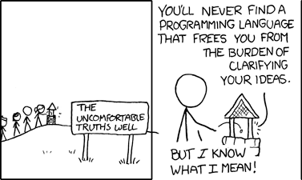

### Warm-Up Exercise

<style>
.plot-exercise {
    font-size: 0.7em;
}
.plot-exercise pre {
    width: 100%;
    margin: 5px 0;
}
</style>
<div class="plot-exercise">

1. Load libraries and data in a notebook:
   ```python
   import pandas as pd
   import plotly.express as px

   listings_df = pd.read_csv('https://pynoon.github.io/data/inside_airbnb_listings_nz_2023_09.csv')
   listings_df
   ```
2. Using what you learned in week 4's tutorial:
   * Make a histogram plot of listing prices *in Auckland*
   * Make a scatter plot of listing of price against review rating for
     listings that *only accomodate one person*
   * Challenge: Add an `island` column to `listings_df` that indicates
     which island the listing is located in based on lat and lon

</div>


### Thanks

* To the host for the great venue!
* Our supporting employers
* New Zealand Python User Group (NZPUG) for support

### Administrivia

* Fire escapes
* Toilets
* Cleaning up after ourselves
* WiFi


### Lunch Talk: AI-Assisted Python Programming

* ChatGPT, GitHub Copilot, etc. are quite good at generating Python code
* Will programming become obsolete?
* Do's/Dont's of programming with AI

### Will programming become obsolete?

<div style="font-size: 0.7em; display: flex; align-items: center;">

* Probably not
* If anything, programming is more important to "glue" AI to
  data/systems
* AI-generated code often needs fixing - **you still need to know how to
  fix it**
* The essence of programming is about *precisely* instructing a
  computer - you still need to carefully **consider** and
  **communicate** those instructions

<div>

<a href="https://xkcd.com/568/">xkcd.com/568</a>
</div>

</div>

### Do's/Dont's of programming with AI

* **DON'T** feed confidential data into public AI tools
* **DON'T** use generated code you don't understand
* **DON'T** use it to replace reading documentation
* **DO** ask it to explain code (as *one* perspective)
* **DO** use it generate snippets for specific tasks
* **DO** be specific in your instructions/requirements
* **DO** ask it to try fix code when the result is wrong


### Tutorial Objectives

* Grouping and summarising data in Pandas and Plotly
* Handling missing data in Pandas


### Independent Work/Homework

1. **Exercise Notebook:**
   * Grouping and summarising exercises
   * See the Exercise Notebook for Week 4 at
     [pynoon.github.io/schedule](https://pynoon.github.io/schedule)
2. **Work through [futurecoder.io](https://futurecoder.io) sections**:
   1. A bit more about strings
   2. Nested Loops
3. Identify a project you can apply Python to
