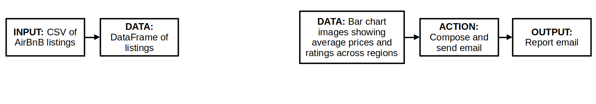
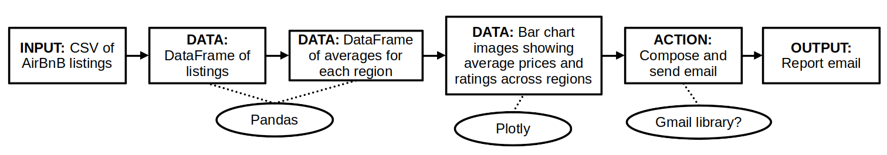

### Warm-Up Exercise

<style>
.plot-exercise {
    font-size: 0.7em;
}
.plot-exercise pre {
    width: 100%;
    margin: 5px 0;
}
</style>
<div class="plot-exercise">

1. Load libraries and data in a notebook:
   ```python
   import pandas as pd
   import plotly.express as px

   listings_df = pd.read_csv('https://pynoon.github.io/data/inside_airbnb_listings_nz_2023_09.csv')
   listings_df
   ```
2. Using what you learned in week 4's tutorial:
   * Make a histogram plot of listing prices *in Auckland*
   * Make a scatter plot of listing of price against review rating for
     listings that *only accomodate one person*
   * Challenge: Add an `island` column to `listings_df` that indicates
     which island the listing is located in based on lat and lon

</div>


### Thanks

* To the host for the great venue!
* Our supporting employers
* New Zealand Python User Group (NZPUG) for support

### Administrivia

* Fire escapes
* Toilets
* Cleaning up after ourselves
* WiFi


### Lunch Talk: Intro to Software Design

* Use these tips while planning your Personal Python Project
* Just *one* possible way to go about software design
* We'll look at an example of a simple report generating system

### 1. Identify Inputs and Outputs

* What formats will inputs and outputs be in?


### 2. Plan high-level steps

* Work **backwards** from the outputs, or **forwards** from the inputs, or both!
* First think about **the data you need to produce**, then how to produce it

<div class="r-stack">

</div>

### 3. Fill in details

* Think about what libraries or techniques you will use for each part
* If necessary, break up major steps into sub-steps
* Next week we'll look at how to write your own functions to split
  your code according to your identified steps



### 4. Get started!

* Start with the most uncertain parts:
  * The part that you don't know how to do yet
  * The part that might not work
* Prioritise working code over perfect code for this
  * You'll likely rewrite it based on what you learn!
* What you learn from doing that might also make you reconsider parts
  or all of your design

### Tutorial Objectives

* Grouping and summarising data in Pandas and Plotly
* Handling missing data in Pandas


### Independent Work/Homework

1. **Exercise Notebook:**
   * Grouping and summarising exercises
   * See the Exercise Notebook for Week 5 at
     [pynoon.github.io/schedule](https://pynoon.github.io/schedule)
2. **Work through [futurecoder.io](https://futurecoder.io) sections**:
   1. A bit more about strings
   2. Nested Loops
3. Identify a Personal Python Project to work on
   * Start designing your solution
