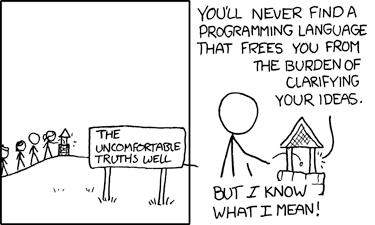

### Warm-Up Exercise

* Continue working on your Personal Python Project
* Pair up and review each other's project work
  * Without explaining your code, can they understand what each line
    achieves?
  * What changes would make it easier to read?
  * Do you have any suggestions to DRY out your partner's code?

### Thanks

* To the host for the great venue!
* Our supporting employers
* New Zealand Python User Group (NZPUG) for support

### Administrivia

* Fire escapes
* Toilets
* Cleaning up after ourselves
* WiFi

### Lunch Talk: AI-Assisted Python Programming

* ChatGPT, GitHub Copilot, etc. are quite good at generating Python code
* Will programming become obsolete?
* Do's/Dont's of programming with AI

### Will programming become obsolete?

* Probably not
* If anything, programming is more important to "glue" AI to
  data/systems
* AI-generated code often needs fixing - **you still need to know how to
  fix it**
* The essence of programming is about *precisely* instructing a
  computer - you still need to carefully **consider** and
  **communicate** those instructions

<a href="https://xkcd.com/568/">xkcd.com/568</a>

### Do's/Dont's of programming with AI

* **DON'T** feed confidential data into public AI tools
* **DON'T** use generated code you don't understand
* **DON'T** use it to replace reading documentation
* **DO** ask it to explain code (as *one* perspective)
* **DO** use it generate snippets for specific tasks
* **DO** be specific in your instructions/requirements
* **DO** ask it to try fix code when the result is wrong

### Tutorial Objectives

* Building user interfaces in Jupyter notebooks
* Using an off-the-shelf AI model

### Independent Work/Homework

1. **Exercise Notebook:**
   * User interface practice
   * See the Exercise Notebook for Week 7 at
     [pynoon.github.io/schedule](https://pynoon.github.io/schedule)
2. **Work through [futurecoder.io](https://futurecoder.io) sections**:
   1. Dictionaries (note: this lesson is at the end of the Futurecoder
      course, so you will need to skip ahead using the Table of
      Contents)
3. Work on your own Python project
