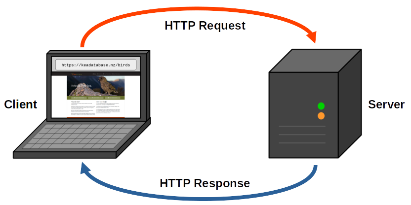
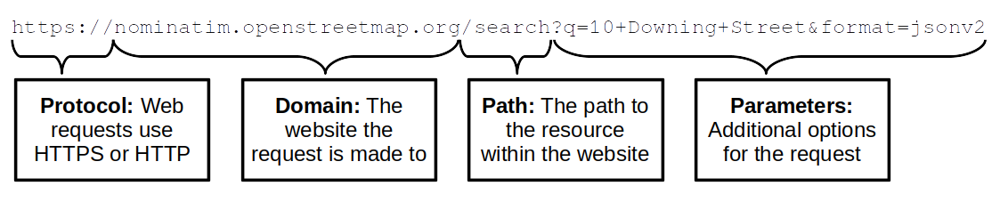

### Warm-Up Exercise

* Continue working on your Personal Python Project
* Pair up and review each other's project work
  * Without explaining your code, can they understand what each line
    achieves?
  * What changes would make it easier to read?
  * Do you have any suggestions to DRY out your partner's code?

### Thanks

* To the host for the great venue!
* Our supporting employers
* New Zealand Python User Group (NZPUG) for support

### Administrivia

* Fire escapes
* Toilets
* Cleaning up after ourselves
* WiFi

### Lunch Talk: Web APIs

* On the World Wide Web, there are:
  * Applications used by *humans* (i.e. websites)
  * Applications used by *other software*
    * **Application Programming Interfaces (APIs)**
* Python can make *requests* to **web APIs** that:
  * Get data (e.g. get news updates)
  * Post data (e.g. publish a social media update)

### Requests and Responses

* **HTTP** is the *protocol* for web communication
* **HTTPS** is the *Secure* version of HTTP

### HTTP Requests

* Every request has a **method**:
  

  * `GET` requests fetch data
  * `POST` requests submit data
  

* Every request is made to a **Uniform Resource Locator (URL)**:

### HTTP Responses

* Responses for web pages return text, images, etc.
* Responses from APIs return *data* your code can use
  * Typically formatted as **JSON** or **XML**

* Every HTTP response also has a **status code**:
  

  * `200 OK` - The request succeeded
  * `404 Not Found` - The path couldn't be found
  * `400 Bad Request` - Request parameters were invalid
  * `500 Internal Server Error` - The server couldn't respond properly
  

### Tips for working with web APIs

* An API should provide **documentation** of:
  * Supported paths and methods for requests
  * Supported parameters for each request
  * The format of data in responses
* Meanings of methods and status codes are **conventions** - not all
  APIs use them consistently
* Always check API **terms & conditions**
* Some APIs require you to sign up for an **API key** or otherwise
  identify your account to make requests
* You can even use Python to make your own web API to service requests
  from other applications!

### Tutorial Objectives

* Retrieving data from a web API

### Independent Work/Homework

1. **Exercise Notebook:**
   * API Exercises
   * See the Exercise Notebook for Week 8 at
     [pynoon.github.io/schedule](https://pynoon.github.io/schedule)
2. **Work through [futurecoder.io](https://futurecoder.io) sections**:
   1. Boolean operators
3. Work on your own Python project
